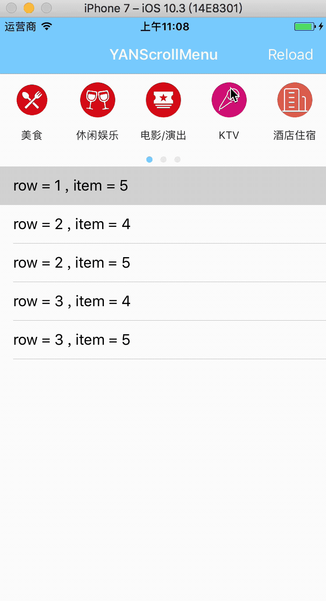

# YANScrollMenu 
[](https://github.com/yanff/YANScrollMenu/blob/master/LICENSE)
[](http://cocoapods.org/?q=YANScrollMenu)
[](http://cocoapods.org/?q=YANScrollMenu)



## Requirements 
---
* **ARC**
* **iOS 8.0+**

## Cocoapods
---
**`YANScrollMenu` is available via [Cocoapods](http://cocoapods.org/), add this line in your podfile :**

```
pod 'YANScrollMenu', '~> 1.0.0'

```
## Usage
---
**1. Import the class  :**

```objective-C
#import "YANScrollMenu.h"

```
**2. Simply initialize a `YANScrollMenu` the same way you set up a regular UIView:**

```objective-c
self.menu = [[YANScrollMenu alloc] initWithFrame:CGRectMake(0, 0, 375,150) delegate:self];
# add to view
[self.view addSubview:self.menu];
    
# you can also set to be a tableHeaderView
self.tableView.tableHeaderView = self.menu;
```
**3. `YANScrollMenuDataSource` must be adopted :**
```objective-c
# the number of items in each section
- (NSUInteger)scrollMenu:(YANScrollMenu *)menu numberOfItemsInSection:(NSInteger)section;

# the number of section
- (NSUInteger)numberOfSectionsInScrollMenu:(YANScrollMenu *)menu;

# the dataSource of item
- (id<YANObjectProtocol>)scrollMenu:(YANScrollMenu *)scrollMenu objectAtIndexPath:(NSIndexPath *)indexPath;
```
**4. There're also some function in `YANScrollMenuDelegate` that can be used to customize:**
```objective-C
# the size of item 
- (CGSize)itemSizeOfScrollMenu:(YANScrollMenu *)menu;
   
# the customize view to set to be the header  in each section
- (UIView *)scrollMenu:(YANScrollMenu *)menu headerInSection:(NSUInteger)section;
 
# the height of header    
- (CGFloat)heightOfHeaderInScrollMenu:(YANScrollMenu *)menu;
   
# the height of pageControl  
- (CGFloat)heightOfPageControlInScrollMenu:(YANScrollMenu *)menu;

# automatic update frame or not
- (BOOL)shouldAutomaticUpdateFrameInScrollMenu:(YANScrollMenu *)menu;
   
# the callback when the item did selected  
- (void)scrollMenu:(YANScrollMenu *)menu didSelectItemAtIndexPath:(NSIndexPath *)indexPath;
```

**5. Custom appearance :**
```objective-c
# the icon size of item
[[YANMenuItem appearance] setIconSize:30];

# the cornerRadius of icon
[[YANMenuItem appearance] setIconCornerRadius:15];

# the textFont of the  label
[[YANMenuItem appearance] setTextFont:[UIFont systemFontOfSize:12]];

# the textColor of the  label
[[YANMenuItem appearance] setTextColor:[UIColor darkTextColor]];

# the space between icon and label
[[YANMenuItem appearance] setSpace:5];
```

## Dependency
---

**YANScrollMenu depend on  `SDWebImage` and  `Masonry`.**
**Notes** : When the version of  `SDWebImage` large than `3.8.2` , gif will not be supported.

## Release Notes

* **V 1.0.0**    The framework has been refactored
* **V 0.9.1**    Fix some bug and optimize the code
* **V 0.9.0**    The first version

## License
---
YANScrollMenu is released under the MIT license. See LICENSE file for details.

## Contact
---
Any suggestion or question? Please create a Github issue .